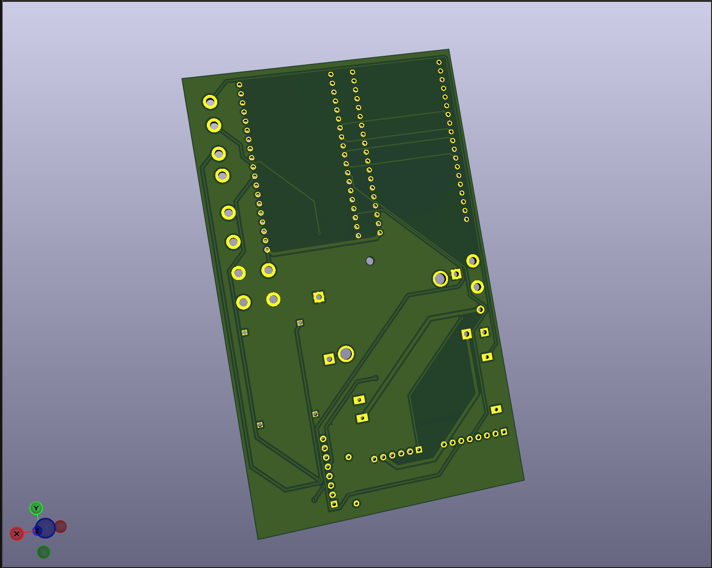
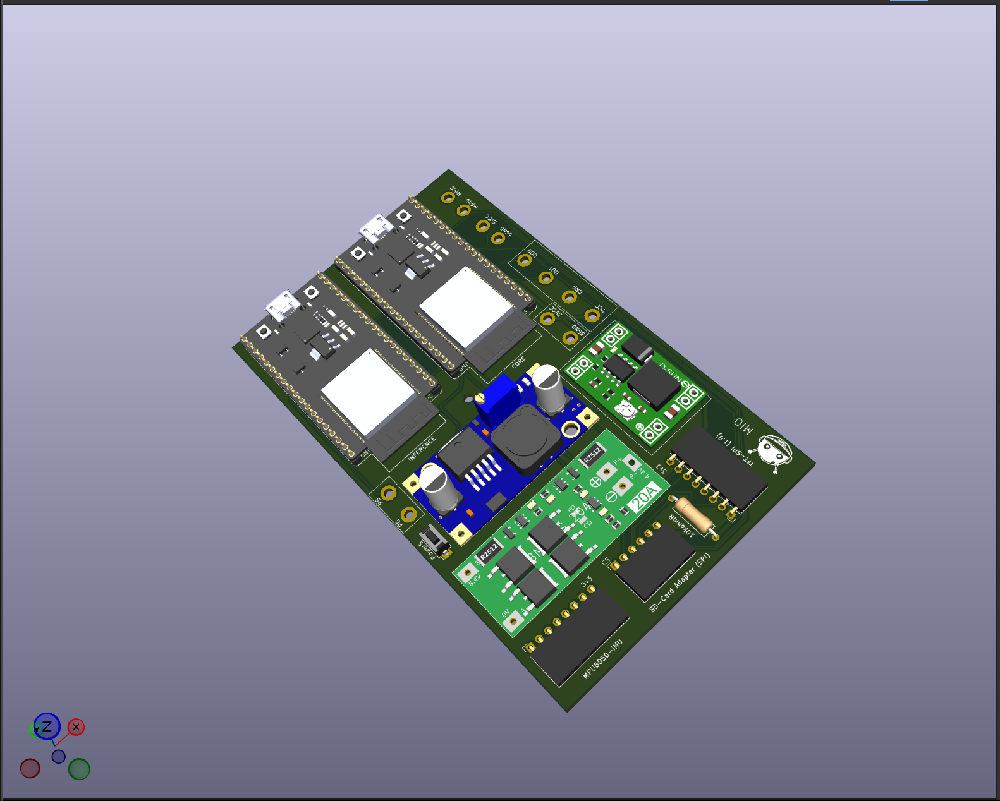
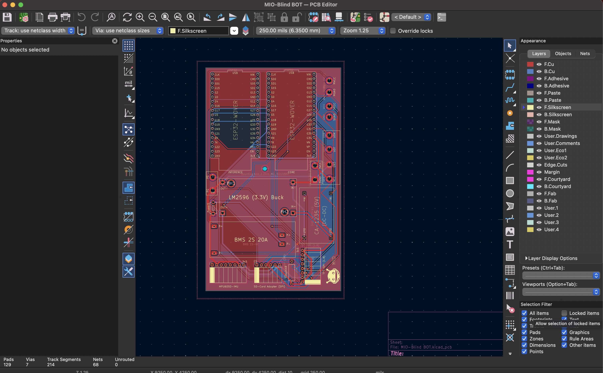

<div align="center">

<!--  -->


**Custom hardware design for MIO — a wearable assistive device for blind and low-vision users**

[](https://www.kicad.org/)
[]()
[]()
[]()

</div>

---

## About This Repository

This repository contains the complete PCB hardware design for **MIO**, a dual-ESP32 wearable assistive device. The board serves as the central interconnect and power-management platform of the system, tying together the compute modules, motion sensing, camera pan-tilt actuation, display feedback, and battery power delivery into a single wearable-ready design.

This is a hardware-only repository — schematics, PCB layout, manufacturing outputs, and supporting documentation live here. Firmware for the system is maintained separately.

### Key Subsystems

- **Dual ESP32 compute architecture** — separate Core and Inference module footprints
- **ESP32-CAM interconnect** — pan-tilt servo header + camera signal breakout
- **Power management** — single-cell Li-ion BMS input, with onboard 5V (CA-1235) and 3.3V (LM2596) regulation stages
- **IMU integration** — MPU6050 motion/orientation sensor interface
- **Display interface** — 1.8" ST7735 TFT (SPI) connector
- **Servo control headers** — MG90S-compatible pan/tilt outputs

---

## Board Renders

<div align="center">

| Front | Back |
|:---:|:---:|
|  |  |



**[▶ Watch the 3D board walkthrough](Documentation/MIO-3D-Video.mp4)**

</div>

---

## PCB Layout

<div align="center">

</div>

---

## Schematics

The full schematic set is available as PDF for quick review without opening KiCad:

- [MIO Schematic — Sheet 1](Documentation/MIO-Schematic%281%29.pdf)
- [MIO Schematic — Sheet 2](Documentation/MIO-Schematic%282%29.pdf)

For the editable source, see [`Hardware/MIO-Blind BOT.kicad_sch`](Hardware/MIO-Blind%20BOT.kicad_sch).

---

## Manufacturing Files

Ready-to-fabricate outputs are provided for direct submission to a PCB manufacturer (JLCPCB, PCBWay, or equivalent), plus a Bill of Materials for sourcing components.

<div align="center">

### [⬇ Download Gerbers (MIO-Gerber.zip)](Manfacturing/MIO-Gerber.zip) &nbsp;|&nbsp; [⬇ Download BOM (MIO-Blind BOT.csv)](Manfacturing/MIO-Blind%20BOT.csv)

</div>

| File / Folder | Description |
|---|---|
| [`MIO-Gerber.zip`](Manfacturing/MIO-Gerber.zip) | Complete Gerber file set for fabrication |
| [`MIO-Gerbers/`](Manfacturing/MIO-Gerbers) | Unpacked Gerber layer files |
| [`MIO-Drill/`](Manfacturing/MIO-Drill) | Drill files (NC drill / Excellon) |
| [`MIO-Blind BOT.csv`](Manfacturing/MIO-Blind%20BOT.csv) | Bill of Materials (BOM) |

---

## Repository Structure

```
MIO-Blind-Bot-PCB/
├── Documentation/
│   ├── MIO-3D-PCB-Back.png
│   ├── MIO-3D-PCB-Front.png
│   ├── MIO-3D-Video.mp4
│   ├── MIO-Complete-3D.png
│   ├── MIO-PCB-Layout.png
│   ├── MIO-Schematic(1).pdf
│   └── MIO-Schematic(2).pdf
├── Hardware/
│   ├── MIO-Blind BOT.kicad_pcb
│   ├── MIO-Blind BOT.kicad_pro
│   └── MIO-Blind BOT.kicad_sch
├── Manfacturing/
│   ├── MIO-Drill/
│   ├── MIO-Gerbers/
│   ├── MIO-Blind BOT.csv
│   └── MIO-Gerber.zip
├── Symbols/
│   └── MIO-Logo.png
└── README.md
```

---

## Design Environment

| | |
|---|---|
| **EDA Tool** | [KiCad](https://www.kicad.org/) 10.0 |
| **Layers** | 2-layer (F.Cu / B.Cu) |
| **Design Type** | Wearable power & interconnect board |
| **First Revision** | First custom PCB design for the MIO project |

---

## Getting Started

To open and edit this design locally:

1. Install [KiCad](https://www.kicad.org/download/) (v8 or later recommended).
2. Clone this repository:
   ```bash
   git clone https://github.com/GuruManoharGuptaBaratam/MIO-Blind-Bot-PCB.git
   ```
3. Open [`Hardware/MIO-Blind BOT.kicad_pro`](Hardware/MIO-Blind%20BOT.kicad_pro) in KiCad.

To order the board as-is, download [`MIO-Gerber.zip`](Manfacturing/MIO-Gerber.zip) above and upload it directly to your preferred PCB fabricator. Use [`MIO-Blind BOT.csv`](Manfacturing/MIO-Blind%20BOT.csv) to source and place components.

---

## Roadmap

- [ ] Footprint library documentation
- [ ] 3D model / STEP file exports
- [ ] Bring-up and test notes

---

## License

License to be finalized — see repository for updates.

---

<div align="center">
<sub>Part of the <b>MIO</b> project.</sub>
</div>